<div align="center">


# Mutee ur Rehman

### BS AI Student · Applied AI Developer · Full-Stack Web Developer

<p>
  <a href="mailto:muteekhan06@gmail.com">
    
  </a>
  <a href="https://www.linkedin.com/in/mutee-ur-rehman-developer/">
    
  </a>
  <a href="https://muteeurrehman-portfolio.vercel.app/">
    
  </a>
  <a href="https://github.com/muteekhan06">
    
  </a>
</p>


</div>

---

## Developer Snapshot

<table>
<tr>
<td align="center" width="25%">

<br /><br />
RAG workflows, embeddings, prompt design, LLM APIs
</td>
<td align="center" width="25%">

<br /><br />
Responsive interfaces, dashboards, SaaS-style products
</td>
<td align="center" width="25%">

<br /><br />
Node.js, REST APIs, Supabase, PostgreSQL
</td>
<td align="center" width="25%">

<br /><br />
Python scripting, scraping concepts, workflow automation
</td>
</tr>
</table>

---

## Tech Stack

<div align="center">

### Core Tools


<br />
<br />


</div>

---

## Featured Work

<table>
<tr>
<td width="50%" valign="top">

<div align="center">

### CarMandi

<a href="https://www.carmandi.pk">
  
</a>

<br />
<br />


</div>

<br />

**Marketplace-style web product** for vehicle discovery, listings, and auction-oriented user flows.

```txt
Vehicle Listings  ->  Auction Flow  ->  User Journey
Responsive UI     ->  Product Logic ->  Marketplace UX
```

</td>
<td width="50%" valign="top">

<div align="center">

### Modaya

<a href="https://modaya.app">
  
</a>

<br />
<br />


</div>

<br />

**Privacy-focused virtual try-on product** with modern SaaS-style frontend and user-centered flow.

```txt
Product UI      ->  Try-On Flow  ->  Privacy First
Responsive UX   ->  Clean Pages  ->  Product Journey
```

</td>
</tr>
</table>

---

## Applied AI Flow

```mermaid
flowchart LR
    A["Documents"] --> B["Chunking"]
    B --> C["Embeddings"]
    C --> D["Vector Search"]
    D --> E["Relevant Context"]
    E --> F["Prompt Design"]
    F --> G["LLM Response"]
    G --> H["Source-Grounded Answer"]

    style A fill:#0f172a,stroke:#38bdf8,color:#fff
    style B fill:#0f172a,stroke:#38bdf8,color:#fff
    style C fill:#0f172a,stroke:#60a5fa,color:#fff
    style D fill:#0f172a,stroke:#818cf8,color:#fff
    style E fill:#0f172a,stroke:#22c55e,color:#fff
    style F fill:#0f172a,stroke:#f59e0b,color:#fff
    style G fill:#0f172a,stroke:#f59e0b,color:#fff
    style H fill:#0f172a,stroke:#22c55e,color:#fff
```

<div align="center">



</div>

---

## Project Matrix

<table>
<tr>
<th align="center">Project</th>
<th align="center">Type</th>
<th align="center">Stack</th>
<th align="center">Focus</th>
</tr>

<tr>
<td align="center"><b>CarMandi</b></td>
<td align="center">Marketplace Platform</td>
<td align="center">Next.js · React · TypeScript</td>
<td align="center">Listings · Auction Flow · Responsive UI</td>
</tr>

<tr>
<td align="center"><b>Modaya</b></td>
<td align="center">Virtual Try-On Web App</td>
<td align="center">React · Product UI</td>
<td align="center">Privacy · SaaS UI · User Flow</td>
</tr>

<tr>
<td align="center"><b>RAG Knowledge Assistant</b></td>
<td align="center">Applied AI Project</td>
<td align="center">OpenAI API · Embeddings · RAG</td>
<td align="center">Retrieval · Prompting · Source Answers</td>
</tr>

<tr>
<td align="center"><b>AI Chat Interface</b></td>
<td align="center">LLM UI</td>
<td align="center">React · LLM API</td>
<td align="center">Chat UX · API Flow · Response States</td>
</tr>

<tr>
<td align="center"><b>OLXify</b></td>
<td align="center">Automation Tool</td>
<td align="center">Python · Selenium · Sheets API</td>
<td align="center">Data Extraction · Sync Workflow</td>
</tr>
</table>

---

## GitHub Analytics

<div align="center">


<br />
<br />


<br />
<br />


</div>

---

## Achievement

<div align="center">

<table>
<tr>
<td align="center">


<br />
<br />

### Lahore, Pakistan -> Baku, Azerbaijan

Awarded a fully funded trip to Baku, Azerbaijan for achieving 3rd position worldwide in the CICA Essay Writing Competition 2025.

</td>
</tr>
</table>

</div>

---

## Current Direction

<div align="center">

<table>
<tr>
<td align="center" width="33%">

<br /><br />
RAG, LLM apps, prompt design, retrieval quality
</td>
<td align="center" width="33%">

<br /><br />
Next.js, APIs, dashboards, SaaS-style applications
</td>
<td align="center" width="33%">

<br /><br />
Clean UI, reliability, maintainability, real user flows
</td>
</tr>
</table>

</div>

---

## Contact

<div align="center">

<a href="mailto:muteekhan06@gmail.com">
  
</a>
<a href="https://www.linkedin.com/in/mutee-ur-rehman-developer/">
  
</a>
<a href="https://muteeurrehman-portfolio.vercel.app/">
  
</a>

<br />
<br />


</div>
