 
 

 
 

---

## Developer Console

<table align="center" width="100%">
<tr>
<td align="center" width="25%">

  
<b>RAG</b> 
Embeddings 
Prompt Design 
LLM APIs
</td>
<td align="center" width="25%">

  
<b>React / Next.js</b> 
Dashboards 
Responsive UI 
SaaS Interfaces
</td>
<td align="center" width="25%">

  
<b>APIs</b> 
Node.js 
Supabase 
PostgreSQL
</td>
<td align="center" width="25%">

  
<b>Python</b> 
Scripts 
Data Tools 
Workflows
</td>
</tr>
</table>

---

## Tech Orbit

 
 

---

## Featured Project Cards

<table align="center" width="100%">
<tr>
<td align="center" width="50%" valign="top">

### CarMandi

  

  

<pre align="left">
Vehicle Discovery
      |
      v
Listing Pages -> Auction Flow -> User Journey
      |
      v
Responsive Marketplace UI
</pre>

</td>
<td align="center" width="50%" valign="top">

### Modaya

  

  

<pre align="left">
Privacy First
      |
      v
Product UI -> Try-On Flow -> User Experience
      |
      v
Modern SaaS-Style Frontend
</pre>

</td>
</tr>
</table>

<table align="center" width="100%">
<tr>
<td align="center" width="50%" valign="top">

### RAG Knowledge Assistant

  

<pre align="left">
Documents -> Chunking -> Embeddings
      -> Vector Search -> Context
      -> Prompt -> Source-Grounded Answer
</pre>

</td>
<td align="center" width="50%" valign="top">

### AI Chat Interface

  

<pre align="left">
User Message -> API Request -> LLM Response
      -> Loading States -> Chat UI
      -> Clean Interaction Flow
</pre>

</td>
</tr>
</table>

---

## Visual Project Map

```mermaid
flowchart TB
    A["Mutee ur Rehman<br/>Applied AI + Full-Stack"]:::center

    A --> B["CarMandi<br/>Marketplace Platform"]
    A --> C["Modaya<br/>Virtual Try-On Web App"]
    A --> D["RAG Knowledge Assistant<br/>Applied AI Project"]
    A --> E["AI Chat Interface<br/>LLM UI"]
    A --> F["OLXify<br/>Automation Tool"]

    B --> B1["Next.js"]
    B --> B2["React"]
    B --> B3["TypeScript"]
    B --> B4["Listings + Auction Flow"]

    C --> C1["React"]
    C --> C2["Product UI"]
    C --> C3["Privacy-First UX"]

    D --> D1["OpenAI API"]
    D --> D2["Embeddings"]
    D --> D3["Vector Search"]
    D --> D4["Source Answers"]

    E --> E1["LLM API"]
    E --> E2["Chat UX"]
    E --> E3["Response States"]

    F --> F1["Python"]
    F --> F2["Selenium"]
    F --> F3["Google Sheets API"]

    classDef center fill:#0f172a,stroke:#38bdf8,color:#ffffff,stroke-width:2px;
    classDef project fill:#111827,stroke:#60a5fa,color:#ffffff,stroke-width:1.5px;
    classDef stack fill:#172554,stroke:#93c5fd,color:#ffffff;
    classDef ai fill:#134e4a,stroke:#2dd4bf,color:#ffffff;
    classDef gold fill:#451a03,stroke:#f59e0b,color:#ffffff;

    class B,C,E,F project;
    class D ai;
    class B1,B2,B3,C1,C2,E1,E2,E3,F1,F2,F3 stack;
    class B4,C3,D1,D2,D3,D4 gold;
```

---

## Applied AI Pipeline

```mermaid
flowchart LR
    A["Raw Docs"] --> B["Clean Text"]
    B --> C["Chunking"]
    C --> D["Embeddings"]
    D --> E["Vector Store"]
    E --> F["Retrieve Context"]
    F --> G["Prompt Design"]
    G --> H["LLM Response"]
    H --> I["Source-Grounded Answer"]

    style A fill:#0f172a,stroke:#38bdf8,color:#fff
    style B fill:#0f172a,stroke:#38bdf8,color:#fff
    style C fill:#0f172a,stroke:#60a5fa,color:#fff
    style D fill:#0f172a,stroke:#818cf8,color:#fff
    style E fill:#0f172a,stroke:#22c55e,color:#fff
    style F fill:#0f172a,stroke:#22c55e,color:#fff
    style G fill:#0f172a,stroke:#f59e0b,color:#fff
    style H fill:#0f172a,stroke:#f59e0b,color:#fff
    style I fill:#0f172a,stroke:#22c55e,color:#fff
```

---

## Build Flow

```mermaid
flowchart LR
    A["Idea"] --> B["UI Flow"]
    B --> C["Frontend"]
    C --> D["API Layer"]
    D --> E["Database"]
    E --> F["AI / Automation"]
    F --> G["Testing"]
    G --> H["Deployment"]

    style A fill:#0f172a,stroke:#60a5fa,color:#fff
    style B fill:#0f172a,stroke:#60a5fa,color:#fff
    style C fill:#0f172a,stroke:#38bdf8,color:#fff
    style D fill:#0f172a,stroke:#22c55e,color:#fff
    style E fill:#0f172a,stroke:#22c55e,color:#fff
    style F fill:#0f172a,stroke:#f59e0b,color:#fff
    style G fill:#0f172a,stroke:#a78bfa,color:#fff
    style H fill:#0f172a,stroke:#38bdf8,color:#fff
```

---

## GitHub Analytics

 
 

 
 

---

## Current Direction

<table align="center" width="100%">
<tr>
<td align="center" width="33%">

  
RAG, LLM apps, prompt design, retrieval quality
</td>
<td align="center" width="33%">

  
Next.js, APIs, dashboards, SaaS-style applications
</td>
<td align="center" width="33%">

  
Clean UI, reliability, maintainability, real user flows
</td>
</tr>
</table>

---

## Connect

 
 

